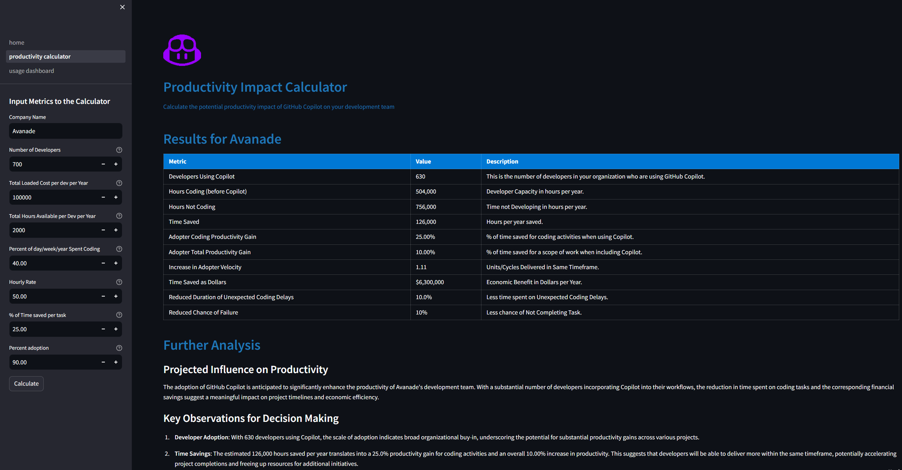
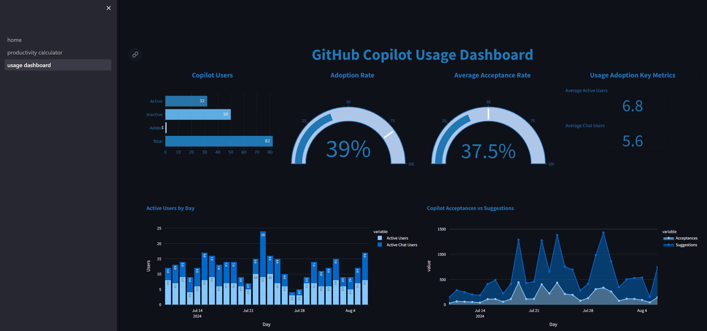
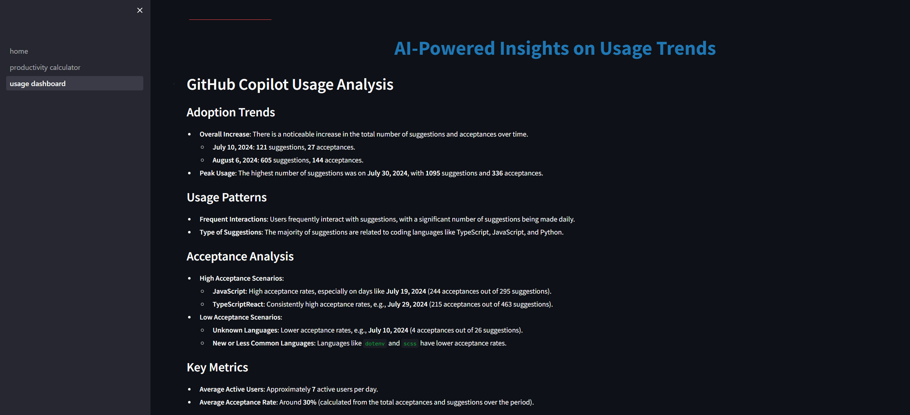

# GitHub Copilot Usage and Adoption Analysis

[](http://commitizen.github.io/cz-cli/)


[](https://avanade.github.io/code-of-conduct/)
[](https://avanade.github.io/maturity-model/)


## Overview
This Python application leverages the power of the Streamlit Web Framework to bring you two features: A Productivity Impact Calculator and a GitHub Copilot usage dashboard. It can be integrated with Azure OpenAI for enhanced AI-driven Analysis functionality.

## Productivity Impact Calculator



## GitHub Copilot Usage Dashboard



### AI Powered Insights (with GHCP Usage as context)



## Licensing

```
This project is licensed under the MIT License - see the `LICENSE` file for details.
```


## Documentation
The `docs` folder contains [more detailed documentation](./docs/start-here.md), along with setup instructions.

## Contact
Feel free to [raise an issue on GitHub](https://github.com/Avanade/ghcp-usage-dashboard/issues), or see our [security disclosure](./SECURITY.md) policy.

## Contributing
Contributions are welcome. See information on [contributing](./CONTRIBUTING.md), as well as our [code of conduct](https://avanade.github.io/code-of-conduct/). Avanade asks that all commits sign the [Developer Certificate of Origin](https://developercertificate.org/).

If you're happy to follow these guidelines, then check out the [getting started](./docs/start-here.md) guide.

## Who is Avanade?

[Avanade](https://www.avanade.com) is the leading provider of innovative digital, cloud and advisory services, industry solutions and design-led experiences across the Microsoft ecosystem.

